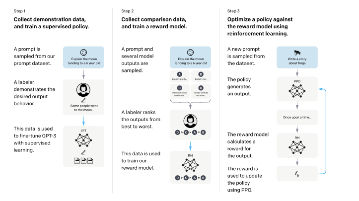
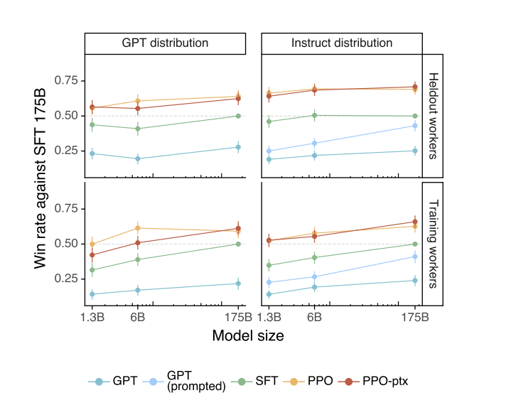
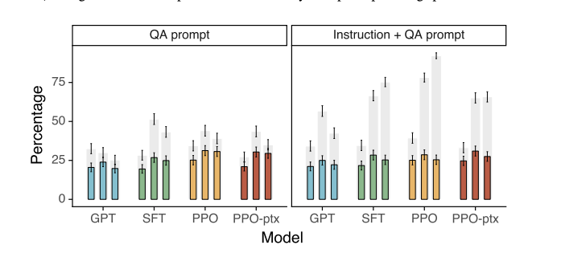
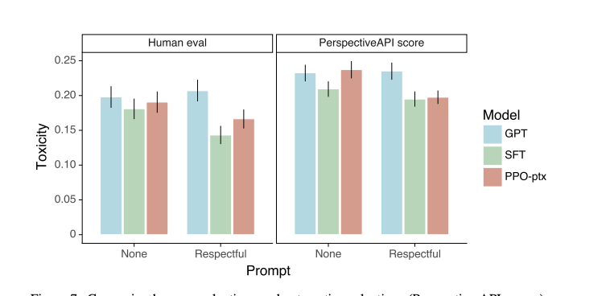

1. Problem description 

    The bigger LM does not gurantee the better performance because LM's output is not aligned with human's intent. (The outputs are untruthful, toxic, not helpful.)

2. Suggested solution - InstructGPT 

    Human feedback dramatically improved the performance here. InstructGPT (1.3B parameters with RLHF) is suggested and it shows better performance than GPT-3 (175B parameters). In parameter wise, 100x fewer. 

3. How InstructGPT is implemented

    
    Figure 1. InstructGPT

        1) Collect demonstration data and train s supervised policy 
        2) Collect comparison data and train RM (reward model)
        3) Optimize a policy against the RM using PPO  

4. How results are analyzed 

    What "alighed" measured? 
    - Truthfulness (honesty)
    - Harms 
        - labelers measure in some contexts (customer service, minors, sexual, violence)

    Win rate against baseline (SFT 175B) 
    

    InstructGPT outperforms GPT-3 in truethfulness, toxicity etc. 
    
    

    Note that InstructGPT still makes simple mistakes such as halucination. But it looks very promising even for instructions outside of training data. 

5. More discussion 

    1) Implications
        1) Cost of RLHF is modest 
        2) Generalization out of supervised training (eg. non-English tasks are also improved)
        3) Minimal regression introduced by fine tuning
        4) Alignment techniques are validated

    2) Room to improve
        1) Better human labelers (currently 1 contractor 40 people)
        2) More sophisticated model (sometimes HF makes more toxic outputs)

    3) More things to consider 
        
        Alighment technique is just one of many trials to mitigate harms from LM. Actually, it can lead more harmful easily using HF. 

