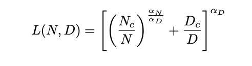
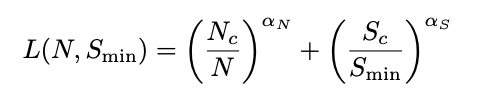
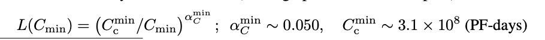

1. Problem  

    This paper is answering what factors impact most to the loss in transformer language models. 

2. Answer 
    
    The loss reduces when `N` (the number of parameters), `D` or `S` (dataset size, step size), and `C` (the amount of computes) grow. 

    Other factors like model shape, depth, width, the number of self-attention heads impact very weakly. 

    Among `N`, `D`, `C`, Big Model (the high number of parameters `N`) is more critical than Big Dataset (`D`) in the sense of sample efficiency.

3. Details 

    1) Loss(L) with N (the number of parameters of model) and D (dataset size)
        

    2) L with N and S (step size) 
        

    3) L with C (the amount of computes)
        