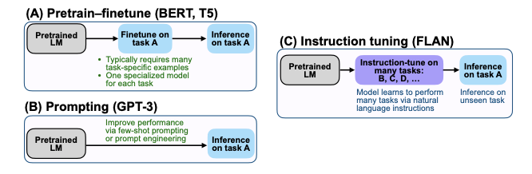
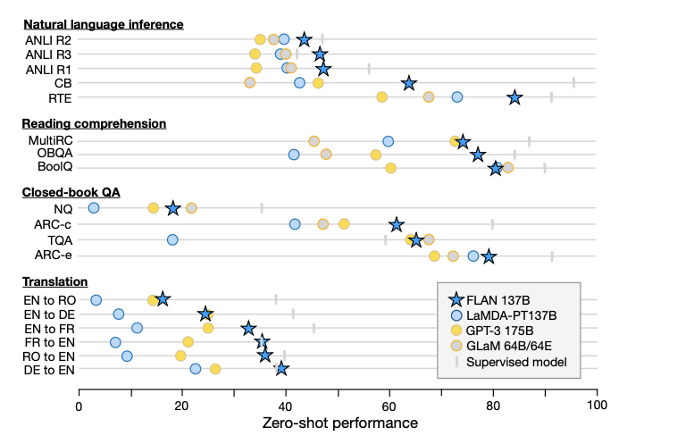

1. Problem description 

    Zero-shot learning in ML is not easy too achieve. 
    Note that zero shot learning means classification on unseen tasks without pre-learning. 

2. Solution

    FLAN (finetuned language model) or instruction utning is quite good for implementing zero shot leanring. 

    https://github.com/google-research/flan

3. What is FLAN 

    A pretrained LM of 137B params + instruction tuning (finetuning the model on 60 NLP datasets). 

    

4. FLAN performance 

    Better than 175B GPT3 with 25 datasets 
   
    Better than 175B GPTe with few shots. 

5. How FLAN is implemented  

    1) Preparing instruction tuning dataset 

        Transformed existing datates to instructional format to save resources. 

        Template includes OPTIONS to inform the model the desired classes. 

    2) Evaluation 

        To evaluatte zero shot performance, used all the other instruction tunining datasets and test the unseen tasks based on datasets at step 1) 

6. Results 

    

    FLAN shows better performances on "NLI, Reading comprehension, QA, Translation". 

    However, FLAN is not so good at "commensense reasoning."

7. Observations     

    "Genernal models" can be improved by labled data designed for "special models." FLAN is one example. 
    

